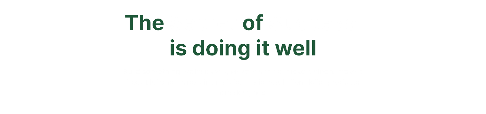
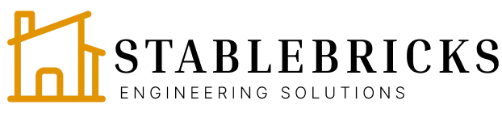
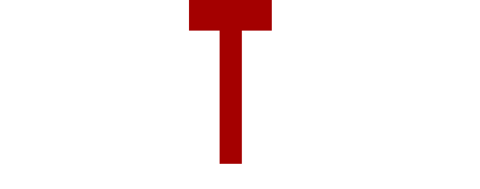

  

<h1 align="center">Hi there, I'm Abdulrahman Dauda! 👋</h1>

  
  
  

 Solving For the World...

## 🚀 Skills

  
  
  
  
  
  
  
  
  

## 🏆 Projects

<table>
  <tr>
    <td align="center">
      <a href="https://stablebricks.com">
        
         
        <b>STABLEBRICKS</b>
      </a>
       
      Real Estate Investment App
    </td>
    <td align="center">
      <a href="https://ict.jg.gov.ng">
        
         
        <b>JICTDE</b>
      </a>
       
      Jigawa State ICT and Digital Economy
    </td>
    <td align="center">
      <a href="https://nillar.com">
        
         
        <b>Nillar Magazine</b>
      </a>
       
      Public Magazine App
    </td>
  </tr>
</table>

## 🎯 Current Focus

- 🌱 I'm currently learning Apollo, GraphQL, and Rust
- 👯 I'm looking to collaborate on open-source projects, innovative web applications,
- 🤔 I'm looking for help with advanced React patterns, system design,
- 💬 Ask me about JavaScript, React, Node.js, Python, Next.JS

## 🎉 Fun Fact

[Insert a fun fact about yourself, e.g., "I can solve a Rubik's cube in under 2 minutes!"]

Thanks for visiting my profile! Feel free to reach out if you want to collaborate on a project or just say hi! 😊

